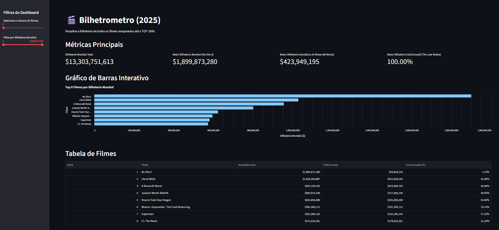

# 🎬 Bilhetrometro

## 🌟 Visão Geral

Este projeto é um dashboard interativo que permite visualizar e analisar o desempenho de bilheteria até o filme de Rank 1000 mais bem-sucedidos do mundo em 2025. 

## 🚀 Funcionalidades

* **Métricas Principais:** Visualize instantaneamente a bilheteria mundial total, o filme com a maior arrecadação e os destaques dos mercados domésticos e estrangeiros.
* **Gráfico Interativo:** Um gráfico de barras dinâmico do `Altair` que mostra o ranking dos filmes com base na bilheteria mundial. É possível interagir com o gráfico para ver detalhes de cada filme.
* **Filtros na Barra Lateral:** Personalize a visualização com filtros para selecionar o número de filmes e a faixa de bilheteria mundial de interesse.
* **Tabela Dinâmica:** Uma tabela detalhada com os dados dos filmes, incluindo bilheteria mundial, doméstica (EUA/Canadá) e a porcentagem de contribuição do mercado doméstico.

## 🔧 Tecnologias Utilizadas

* **Python:** Linguagem de programação principal.
* **Streamlit:** Framework para a construção da aplicação web e do dashboard.
* **Pandas:** Biblioteca para manipulação e análise de dados.
* **Altair:** Biblioteca para a criação de visualizações de dados interativas.
* **Numpy:** Biblioteca para suporte a operações numéricas.

## 📊 Fonte dos Dados

Os dados foram obtidos através de uma extração via scraping do site **Box Office Mojo**, especificamente da página de bilheteria mundial do ano de 2025 até a data de extração, que realizei no dia 13/08/2025.

## 📈 Exemplo da Aplicação

